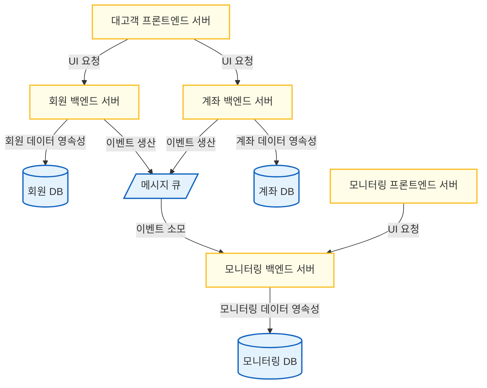
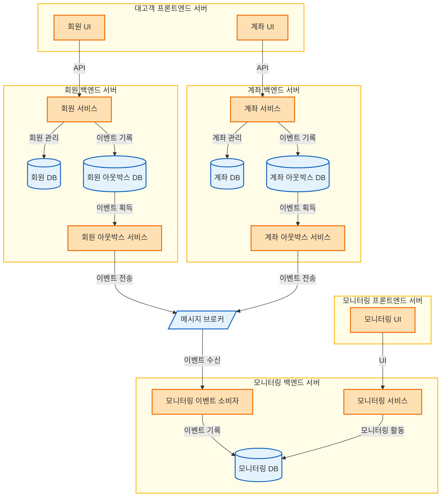

# SimpleTransaction

이 프로젝트는 간단한 Toy 프로젝트이며, REST API를 통해 간단한 기능을 가진 데모 금융 시스템을 지원한다.

## 1. 프로젝트의 소개

### 1.1. 목적

이 프로젝트를 통해 다음과 같은 새로운 기반원리와 기술을 학습한다.

- 보안
    - Spring Security
    - JWT
- 데이터베이스
    - MySQL
    - DOMA

### 1.3. 의사결정 기준

이 프로젝트를 통해 유지보수가 용이한 코드를 작성하고, 단위 테스트를 관리하며, 관측가능성을 복습하고
기존 [SimpleWebsocketMQ](https://github.com/ywcheong/simple-websocket-mq)에서 배운 점을 토대로 코드베이스를 개선한다.

임의의 시점에 장애의 발생을 가정하고 프로그램을 구현한다. 단, 백업 및 다중화 대책을 마련하는 것은 지나치게 많은 품이 들기 때문에, 여기서는 인프라에 일시적인 장애가 발생할 수는 있지만 데이터는 영속적이라고
가정한다. (인프라 파괴 및 유실 시나리오 배제)

도메인 주도 설계를 도입하되, 부분적으로만 도입한다. (설계로 인해 실습을 못하는 문제 생김)

## 2. 도메인 주도 설계

### 2.1. 요구사항 정의 (Naive)

- 회원 관리
    - 회원 가입, 회원 탈퇴를 지원한다.
    - 회원 로그인, 회원 로그아웃을 지원한다.
- 계좌 관리
    - 회원은 계좌를 개설하거나 폐쇄할 수 있다.
    - 회원은 계좌에 입금하거나 출금할 수 있다.
    - 회원은 보유한 계좌의 목록을 조회할 수 있다.
    - 회원은 한 계좌의 상세 정보를 조회할 수 있다.
        - 회원은 자신이 보유한 모든 계좌를 조회할 수 있다.
        - 회원은 한 계좌의 잔액과 보류잔액을 조회할 수 있다.
        - 회원은 한 계좌의 모든 거래기록을 조회할 수 있다.
    - 회원은 다른 계좌로 송금할 수 있다.
        - 고액송금은 시스템 관리자가 이를 직접 승인하기 전까지는 보류된다.
- 모니터링
    - 모니터링 관리자는 시스템의 모든 이벤트를 실시간으로 조회할 수 있어야 한다.
        - 회원 관리, 계좌 관리 이벤트가 이에 포함된다.
    - 모니터링 관리자는 고액송금 요청을 확인하고, 이를 직접 승인하거나 거부해야 한다.

### 2.2. 도메인 식별

- 핵심 도메인
    - 계좌 관리
- 지원 도메인
    - 회원 관리
- 일반 도메인
    - 모니터링

이를 그대로 바운디드 컨텍스트로 활용한다.

- 회원관리 컨텍스트
- 계좌관리 컨텍스트
- 모니터링 컨텍스트

### 2.3. 도메인 용어 정의

- 회원관리 도메인: 회원(Member)
    - 가입(Register)
    - 탈퇴(Withdraw)
    - 로그인(Login)
    - 로그아웃(Logout)
- 계좌관리 도메인: 계좌(Account)
    - 개설(Open)
    - 폐쇄(Close)
    - 조회(Lookup)
        - 잔고~ (Balance~)
            - 보류잔고 (Pending Balance~)
        - 거래기록~ (TransactionHistory~)
    - 실행(Execute)
    - 입금(Deposit)
    - 출금(Withdraw)
    - 송금(Transfer)
        - 고액~ (Large~)
        - 보류 (Pending)
        - 즉시 (Immediate)
- 모니터링 도메인 (Monitoring)
    - 모니터링 관리자 (Monitoring Admin)
    - 시스템 이벤트 (System Event)
    - 고액송금 (" = 계좌관리 도메인)
        - 승인(Approve)
        - 거부(Reject)

## 3. 시스템 디자인

### 배포 디자인

### 구성요소 디자인

- 선택: 메시지 브로커를 통해 회원/계좌 시스템과 모니터링 시스템을 분리.
    - 근거: 모니터링 이벤트 확인은 중요하지만 결과적 일관성으로 충분. 시스템 결합도를 낮추기에 유리한 디자인.
    - 비용: 모니터링 시스템의 즉시 일관성이 결과적 일관성으로 격하.
- 선택: 아웃박스 패턴 도입으로 메시지 발행
    - 근거: DBMS와 Kafka 양측 모두를 포함하는 신뢰성 있는 Dual-write의 어려움.
    - 비용: 서비스-MQ 구조가 서비스-DBMS-서비스-MQ 구조로 복잡성 증가.

### 인터페이스 디자인

#### 회원 서비스

| 엔드포인트                     | 메서드    | 설명     |
|---------------------------|--------|--------|
| `/accounts`               | GET    | 계좌목록조회 |
| `/accounts`               | POST   | 계좌개설   |
| `/accounts/{id}`          | GET    | 계좌조회   |
| `/accounts/{id}`          | DELETE | 계좌폐쇄   |
| `/accounts/{id}/deposit`  | POST   | 입출금실행  |
| `/accounts/{id}/withdraw` | POST   | 입출금실행  |

| 엔드포인트             | 메서드  | 설명     |
|-------------------|------|--------|
| `/transfers`      | POST | 이체실행   |
| `/transfers/{id}` | POST | 고액송금처리 |

모든 엔드포인트는 멱등하다.

#### 모니터링 서비스

| 엔드포인트                         | 메서드 | 설명            |
|-------------------------------|-----|---------------|
| `/monitoring`                 | GET | 최근 이벤트 조회     |
| `/monitoring/large-transfers` | GET | 대기 중인 고액송금 조회 |

모든 엔드포인트는 멱등하다.

<!-- TODO ### 데이터 디자인 -->
